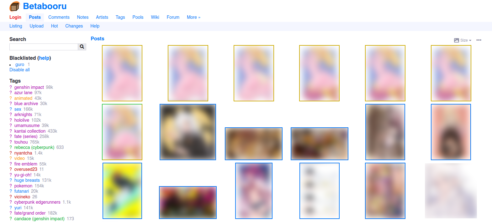

<br>

<div align = center>

[![Badge Discord]][Discord]   
[![Badge Codecov]][Codecov]

<br>
<br>


# Danbooru

*A taggable image board written in Rails.*

<br>
<br>



</div>


## Quickstart

Run this to start a basic Danbooru instance:

```sh
curl -sSL https://raw.githubusercontent.com/danbooru/danbooru/master/bin/danbooru | sh
```

This will install [Docker Compose](https://docs.docker.com/compose/) and use it
to start Danbooru. When it's done, Danbooru will be running at http://localhost:3000.

Alternatively, if you already have Docker Compose installed, you can just do:

```sh
wget https://raw.githubusercontent.com/danbooru/danbooru/master/docker-compose.yaml
docker-compose up
```

## Manual Installation

Follow the [INSTALL.debian](INSTALL.debian) script to install Danbooru.

The INSTALL.debian script is written for Debian, but can be adapted for other
distributions. Danbooru has been successfully installed on Debian, Ubuntu,
Fedora, Arch, and OS X. It is recommended that you use an Ubuntu-based system
since Ubuntu is what is used in development and production.

See [here](https://github.com/danbooru/danbooru/wiki/Ubuntu-Installation-Help-Guide)
for a guide on how set up Danbooru inside a virtual machine.

For best performance, you will need at least 256MB of RAM for PostgreSQL and
Rails. The memory requirement will grow as your database gets bigger.

In production, Danbooru uses PostgreSQL 10.18, but any release later than this
should work.

<br>


<!----------------------------------------------------------------------------->

[Codecov]: https://codecov.io/gh/danbooru/danbooru
[Discord]: https://discord.gg/eSVKkUF


<!---------------------------------[ Badges ]---------------------------------->

[Badge Codecov]: https://img.shields.io/codecov/c/gh/danbooru/danbooru?logo=codecov&logoColor=white&style=for-the-badge&labelColor=F01F7A&color=be1963
[Badge Discord]: https://img.shields.io/discord/310432830138089472?label=Discord&style=for-the-badge&labelColor=6e85d2&color=5a6dac
